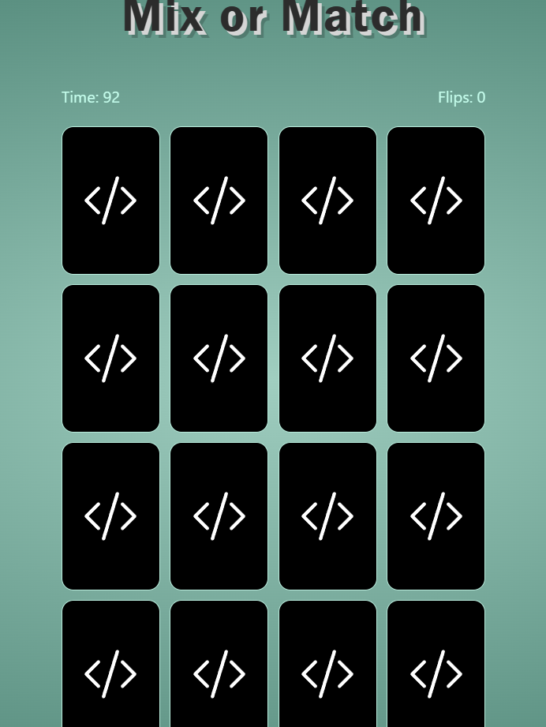

# Memory Match Game

### A dev themed matching game where users have 100 seconds to match all 16 cards in the least amount of flips possible
Play demo at https://jmitch1132.github.io/memory-game/

This project was bootstrapped with [Create React App](https://github.com/facebook/create-react-app).

## Available Scripts

In the project directory, you can run:

### `npm start`

### `npm test`

### `npm run build`

### `npm run eject`
